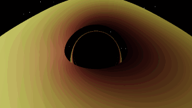
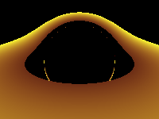

# black_hole — Simulação de buraco negro (Sagittarius A\*) em C++/OpenGL + Blender

**Versão 0.8.0** · Schwarzschild · C++17 · OpenGL 4.3 (compute shader) · Blender 4.x · pt-BR primeiro, [English summary](#english-summary) no fim



*Renderer CPU de referência (`bh_render_cpu --mode relativistic`) na cena `examples/scene_relativistic_showcase.json`: o lado distante do disco aparece arqueado sobre a sombra, o anel de fótons é fino e o lado que se aproxima (esquerda) é mais brilhante por beaming Doppler.*

Simulador em tempo real de **raios de luz (geodésicas nulas) em torno de um buraco negro de Schwarzschild** na escala de Sagittarius A\* (rs ≈ 1,269 × 10¹⁰ m), com:

- o **visual histórico intacto**: `BlackHole3D` sem flags continua a ser exatamente o projeto original (Euler `legacyEulerStep` em `geodesic.comp`, disco âmbar 2,2–5,2 rs, grade espaço-tempo cinza, câmera orbital);
- um **modo científico na GPU** opcional (`--scientific` / `--relativistic`): RK4 no plano orbital de cada raio, colisões contínuas, critério de fuga demonstrado, Doppler + redshift gravitacional;
- um **renderer CPU de referência** (`bh_render_cpu`) determinístico, multithread, em double, que serve de "verdade" para a GPU, para testes e para o Blender;
- um **addon Blender** (`black_hole_bridge`) que monta a cena no mesmo estilo, anima a câmera e importa os renders C++.

> **Honestidade primeiro.** Kerr (spin) **não** é simulado — só há raios analíticos em `kerr_analytic.hpp`. Não há transferência radiativa nem GRMHD. Os únicos números de GPU citados aqui foram medidos com Mesa **llvmpipe** (software). Ver [Limitações](#limitações-honestas).

---

## Sumário

1. [Galeria](#galeria)
2. [Novidades da 0.8.0](#novidades-da-080)
3. [Matriz de funcionalidades](#matriz-de-funcionalidades)
4. [Início rápido](#início-rápido) — [A) científico/headless](#a-científico--headless-sem-opengl) · [B) OpenGL `BlackHole3D`](#b-visualização-opengl-blackhole3d) · [C) Blender](#c-addon-blender)
5. [Referência de CLI](#referência-de-cli)
6. [Testes e CI](#testes-e-ci)
7. [Física: resumo com números medidos](#física-resumo-com-números-medidos)
8. [Limitações honestas](#limitações-honestas)
9. [Mapa do pacote](#mapa-do-pacote)
10. [Documentação](#documentação)
11. [English summary](#english-summary)
12. [Créditos e licença](#créditos-e-licença)

---

## Galeria

Todas as imagens estão em [`docs/images/`](docs/images/) e foram geradas neste repositório (CPU: `bh_render_cpu`; GPU: `BlackHole3D --capture` em Mesa llvmpipe; Blender 4.0.2 Cycles headless).

| | |
|:---:|:---:|
|  |  |
| **Showcase, modo `relativistic`** — disco 3–12 rs (a partir da ISCO), câmera a 18 rs, elevação 1,40 rad, FOV 38°, estrelas procedurais. | **Showcase, modo `blackbody`** — branco-azulado porque o disco de Sgr A\* a 1 % de Eddington chega a T_eff ≈ 87 000 K (pico no UV). |
|  |  |
| **`BlackHole3D` sem flags (GPU, 200×150)** — o artefato histórico da vista inicial: metade superior amarela até o usuário orbitar ([causa](#o-artefato-da-vista-inicial-do-baseline)). | **Baseline legado na GPU, elevação 1,25 rad** — disco âmbar `vec3(1, r, 0.2)`, lente gravitacional, sem artefato. |
|  |  |
| **`bh_render_cpu`, paleta legada, 640×480, elevação 1,25** — RK4 planar em double; a mancha vermelha é a esfera legada a 4 × 10¹¹ m. | **Modo `relativistic`, mesma pose** — paleta legada × redshift gravitacional/Doppler, beaming g⁴ e tonemap Reinhard. |
|  |  |
| **Modo `blackbody`, elevação 1,00** — cor de corpo negro Page–Thorne deslocada por g; nada emite dentro da ISCO (3 rs). | **Blender 4.0.2 Cycles, elevação 1,25** — paleta âmbar em paridade, grade cinza deformada, anéis-guia, horizonte preto. Sem lente no Blender (por design). |

Reproduzir as imagens CPU: `make render` (grava em `build/renders/`). Comandos individuais em [A) científico/headless](#a-científico--headless-sem-opengl).

---

## Novidades da 0.8.0

Resumo; detalhes por área em [`CHANGELOG.md`](CHANGELOG.md) e verificação em [`STATUS.md`](STATUS.md).

- **Óptica relativística** (`bh_scientific`): órbitas circulares, fator de redshift g (Doppler + gravitacional), fluxo Page–Thorne (1974) em forma fechada, corpo negro → sRGB, colisões contínuas segmento–plano/segmento–esfera, fuga por prova matemática (b_c = 2,598 rs), RK45 Dormand–Prince adaptativo, integração no plano orbital (sem singularidade nos polos), raios Kerr analíticos, deflexão de 2.ª ordem.
- **Renderer CPU de referência** `bh_render_cpu`: modos `legacy` / `relativistic` / `blackbody`, RK4 ou RK45, supersampling, céu estrelado, sequências de frames, PNG/BMP/PPM sem dependências.
- **Modo científico na GPU** ligado de verdade em `BlackHole3D`: `--scientific`, `--relativistic`, `--blackbody`, `--scene`, `--capture` e controles de runtime. Sem flags = baseline histórico idêntico (byte a byte, teste `legacy_golden`).
- **Addon validado em Blender 4.0.2, 4.5 e 5.0.1** (Blender 5 removeu `Action.fcurves`; camada `compat.py` usa os *channel bags* das slotted actions). Funciona no Blender da Steam atual.
- **Concordância GPU ↔ CPU** testada em CTest (Mesa llvmpipe sob `xvfb-run`): erro máximo 1/255 na pose principal; e o baseline sem flags é comparado byte a byte com a imagem de referência `docs/images/legacy_default_gpu.png` (`legacy_golden`).
- **Addon Blender 0.8.0**: camada única de coordenadas C++ (Y-up) → Blender (Z-up), disco com espessura, grade e anéis visíveis em Cycles/EEVEE, paleta em paridade exata com o OpenGL, transformação de vista "Raw", ponte de render C++ → Blender, presets de animação.
- **Engenharia**: `Makefile` raiz versionado, CI com 4 jobs (headless, portabilidade Windows/macOS, OpenGL real via llvmpipe, Blender headless), build sem warnings com `-Wall -Wextra -Wpedantic`, 15 testes CTest (12 na árvore sem OpenGL).

---

## Matriz de funcionalidades

| Recurso | Baseline (`BlackHole3D`, sem flags) | Científico GPU (`--scientific` / `--relativistic`) | Renderer CPU (`bh_render_cpu`) | Blender (`black_hole_bridge`) |
|---|---|---|---|---|
| Shader / código | `geodesic.comp` (raiz) | `shaders/geodesic_scientific.comp` | `src/scientific/cpu_renderer.cpp` | `blender/addons/black_hole_bridge/` |
| Integrador | Euler `legacyEulerStep`, `D_LAMBDA = 1e7`, até 60 000 passos | RK4 planar, passo geométrico, até 4000 passos | RK4 planar (passo geométrico) ou RK45 Dormand–Prince | — (geometria estilizada, sem geodésicas) |
| Precisão | float32 | float32 | double | — |
| Coordenadas | esféricas globais (singulares nos polos) | plano orbital de cada raio (θ ≡ π/2) | plano orbital de cada raio | C++ Y-up → Blender Z-up (rotação +90° em X) |
| Colisão com o disco | amostragem pontual (troca de sinal de y) | segmento–plano interpolado | segmento–plano interpolado | malha (anel com Solidify 1e9 m) |
| Fuga | `ESCAPE_R = 1e30` (inalcançável) | prova: saindo + além da esfera de fótons + além da cena | idem | — |
| Cor do disco | `vec3(1, r_norm, 0.2)`, alfa `r_norm` | legada; `--relativistic` aplica Doppler/redshift (sem modo corpo negro na GPU) | `legacy`, `relativistic` (g⁴ + Reinhard), `blackbody` (Page–Thorne) | emissão `(1, r, 0.2)·r` = pixel OpenGL |
| Grade espaço-tempo | sim (cinza `vec4(0.5,0.5,0.5,0.7)`) | sim | não (só raios) | sim (quads + Wireframe) |
| Anéis-guia (1,5 / 2,598 / 3 rs) | não | não | não | sim |
| Lente gravitacional | sim | sim | sim | não (importa render C++ como fundo/plano) |
| Interativo (mouse/teclado) | sim | sim | não | viewport do Blender |
| Headless / sem GPU | não | não (precisa de GL 4.3; llvmpipe serve) | **sim** | sim (`blender --background`) |
| Saída de imagem | janela; `--capture` PNG/BMP/PPM | janela; `--capture` | PNG / BMP / PPM, sequências | render Cycles/EEVEE |
| Determinismo | — | — | bit a bit, independente do nº de threads | — |
| Kerr | não | não | não | não |

---

## Início rápido

Requisitos comuns: compilador **C++17** (GCC, Clang ou MSVC), [CMake](https://cmake.org/) ≥ 3.21, [Git](https://git-scm.com/), Python 3 (testes). OpenGL só é necessário para `BlackHole2D` / `BlackHole3D`.

Use este repositório (o pacote 0.8.0) como diretório de trabalho; todos os comandos abaixo partem da raiz dele. O projeto original, sem as adições 0.8.0, continua disponível no upstream:

```bash
git clone https://github.com/kavan010/black_hole.git   # upstream original (kavan010)
```

### A) Científico / headless (sem OpenGL)

Compila `bh_scientific`, `bh_render_cpu`, `bh_scene_dump`, `quickstart_scientific` e os testes — nenhuma dependência gráfica.

```bash
# via Makefile (atalhos opcionais sobre CMake)
make test                     # configura build/scientific, compila e roda o CTest
make render                   # gera PNGs de exemplo em build/renders/

# ou CMake puro
cmake -S . -B build/scientific -DBLACK_HOLE_BUILD_GL=OFF -DBUILD_TESTING=ON
cmake --build build/scientific
ctest --test-dir build/scientific --output-on-failure
./build/scientific/quickstart_scientific        # rs, ISCO, órbitas, redshift, Page–Thorne, sombra, Kerr analítico
```

Presets equivalentes: `cmake --preset scientific && cmake --build --preset scientific && ctest --preset scientific`.

Exemplos com `bh_render_cpu`:

```bash
B=./build/scientific/bh_render_cpu

# Pose clássica (paleta legada) — a elevação 1,25 evita o artefato da vista inicial
$B --out legacy_el125.png --width 640 --height 480 --elevation 1.25

# Doppler + redshift gravitacional + beaming g⁴, integrador adaptativo
$B --out rel.png --width 640 --height 480 --elevation 1.25 --mode relativistic --integrator rk45

# Cena showcase (disco 3–12 rs, câmera a 18 rs), supersampling 2×2 e estrelas
$B --scene examples/scene_relativistic_showcase.json --mode relativistic \
   --width 640 --height 360 --supersample 2 --stars --out showcase_relativistic.png

# Corpo negro Page–Thorne a 1 % de Eddington (padrão) — mude com --mdot-edd
$B --scene examples/scene_relativistic_showcase.json --mode blackbody \
   --width 640 --height 360 --supersample 2 --stars --out showcase_blackbody.png

# Turntable de 120 frames: grava turn_0000.png … turn_0119.png (azimute varre 2π)
$B --scene examples/scene_relativistic_showcase.json --mode relativistic \
   --width 480 --height 270 --frames 120 --out turn.png
```

Cada execução imprime **uma linha JSON** no stdout, por exemplo (400×300, elevação 1,25, medido neste repositório):

```json
{"frames":1,"width":400,"height":300,"mode":"legacy","integrator":"rk4","shadow_fraction":0.438967,"disk_fraction":0.483583,"object_fraction":0.000933333,"escaped_fraction":0.0765167,"step_limit_rays":0,"mean_steps":102.448,"min_g":0.350226,"max_g":1.4502,"seconds":0.747639,"out":"legacy_el125.png"}
```

### B) Visualização OpenGL (`BlackHole3D`)

Precisa de **GLEW, GLFW3, GLM** e um driver **OpenGL 4.3+** (compute shaders).

**Opção 1 — vcpkg (Windows/macOS/Linux)**

1. Instale as dependências do manifesto (`vcpkg.json` pede `glfw3`, `glm`, `glew`):
   ```bash
   vcpkg install
   vcpkg integrate install   # mostra -DCMAKE_TOOLCHAIN_FILE=/caminho/vcpkg/scripts/buildsystems/vcpkg.cmake
   ```
2. Configure e compile:
   ```bash
   cmake -B build -S . -DCMAKE_TOOLCHAIN_FILE=/caminho/vcpkg/scripts/buildsystems/vcpkg.cmake -DBLACK_HOLE_BUILD_GL=ON
   cmake --build build
   ```
   Ou, com `VCPKG_ROOT` definido: `cmake --preset vcpkg-release && cmake --build --preset vcpkg-release`.

**Opção 2 — Debian/Ubuntu (apt, sem vcpkg)**

```bash
sudo apt update
sudo apt install build-essential cmake ninja-build \
    libglew-dev libglfw3-dev libglm-dev libgl1-mesa-dev
# opcionais: validação de shaders e testes GPU headless (Mesa llvmpipe)
sudo apt install glslang-tools xvfb xauth mesa-utils libgl1-mesa-dri

make build-gl          # = cmake -S . -B build/gl -DBLACK_HOLE_BUILD_GL=ON && cmake --build build/gl
make test-gl           # CTest completo, incl. gpu_cpu_agreement (xvfb-run se não houver display)
make shaders           # glslangValidator nos 4 shaders
```

Os pacotes fornecem os arquivos de desenvolvimento que os `find_package(...)` do `CMakeLists.txt` procuram (há fallbacks para glfw3/glm de distro).

**Executar.** Os shaders são carregados por caminho relativo e copiados para junto do executável no POST_BUILD — rode a partir do diretório de build:

```bash
cd build/gl
./BlackHole3D                                   # baseline histórico (idêntico ao original)
./BlackHole3D --scientific                      # RK4 planar na GPU, rs = 1
./BlackHole3D --relativistic                    # científico + Doppler/redshift no disco
./BlackHole3D --scene ../../examples/scene_relativistic_showcase.json --relativistic
./BlackHole3D --relativistic --capture frame.png   # 1 frame 200×150 → PNG e sai
xvfb-run -a ./BlackHole3D --capture legacy.png     # sem monitor (Mesa llvmpipe)
```

**Controles**

| Entrada | Ação |
|---|---|
| Botão esquerdo (ou do meio) + arrastar | orbitar a câmera (azimute / elevação, elevação limitada a [0,01; π − 0,01]) |
| Roda do mouse | zoom (raio da órbita entre 1 × 10¹⁰ e 1 × 10¹² m) |
| `G` | liga/desliga a gravidade newtoniana entre os objetos (modo legado) |
| Botão direito (segurar) | gravidade ligada enquanto o botão estiver pressionado |

> Dica: a vista inicial do baseline mostra a metade superior amarela — é um artefato histórico preservado de propósito ([explicação](#o-artefato-da-vista-inicial-do-baseline)). Arraste o mouse na vertical para tirar a câmera do plano do disco e ele desaparece.

`BlackHole2D` (`2D_lensing.cpp`) continua disponível como demo 2D de lente.

### C) Addon Blender

Funciona no Blender 4.0+ (inclusive o da Steam); a física/lente continua no C++.

1. `Edit → Preferences → Add-ons → Install from Disk` → `blender/black_hole_bridge.zip` (cópia idêntica em `blender/addons/black_hole_bridge.zip`) → ative **Black Hole Bridge**.
2. Viewport 3D → tecla `N` → aba **Black Hole** → **Cena → Build Full Scene**.
   - Se a câmera estiver dentro da fatia do disco (o caso do default C++, raio 4,997 rs < 5,2 rs, elevação π/2) aparece um **WARNING**; em **Parâmetros**, use **Elevação (rad) = 1.25** para renders limpos.
3. **Guias → Build Guide Rings**: anéis da esfera de fótons (1,5 rs), parâmetro de impacto crítico (2,598 rs) e ISCO (3 rs).
4. **Câmara / animação → Bake Camera Animation**: presets `TURNTABLE`, `ELEVATION_SWEEP`, `DOLLY`, `SPIRAL` com easing `LINEAR` ou `SINE`; **Disco (spin) → Bake Disk Spin** (turbulência opcional, só brilho, desligada por padrão).
5. **Render C++ → Blender → Render via C++ (CPU)**: exporta o JSON da cena, roda `bh_render_cpu` e importa o PNG (ou a sequência) como **fundo da câmera** ou **plano emissivo** voltado para a câmera.
6. **JSON ↔ C++**: exporta/importa `black_hole.scene_params/v1`, o mesmo formato de `BlackHole3D --scene` e `bh_render_cpu --scene`.

Headless: `make blender-scene` (ou `blender --background --factory-startup --python blender/scripts/build_scene_headless.py -- --out "$PWD/build/black_hole_sim.blend"`). No Blender do Ubuntu (sem OpenImageDenoise) desligue o denoising em renders Cycles headless. Rezipar o addon de forma determinística: `make package-addon`.

Guia completo: [`blender/INSTALAR_E_RODAR.md`](blender/INSTALAR_E_RODAR.md).

---

## Referência de CLI

### `BlackHole3D`

```text
BlackHole3D [--scene file.json] [--scientific] [--relativistic] [--blackbody]
            [--exposure E] [--spin-sign +1|-1] [--max-steps N] [--mdot-edd F]
            [--capture out.png] [--help]
```

| Flag | Efeito |
|---|---|
| *(nenhuma)* | Baseline histórico exato: `geodesic.comp` com `legacyEulerStep`, constantes travadas. |
| `--scene file.json` | Carrega `black_hole.scene_params/v1`: massa/rs, câmera (raio, azimute, elevação, FOV, alvo), fatores do disco, objetos (`"objects": []` = nenhum), `gravity`. Com os valores default (`examples/scene_params_example.json`) o frame é idêntico ao de sem flags. |
| `--scientific` | Usa `shaders/geodesic_scientific.comp` (RK4 planar, unidades rs = 1, UBO `SciParams` no binding 4, 48 bytes). Encontrado no cwd, em `shaders/` ou ao lado do executável. |
| `--relativistic` | Implica `--scientific` e acrescenta sombreamento Doppler + redshift gravitacional no disco. |
| `--blackbody` | Implica `--scientific`: disco Page–Thorne com cor de corpo negro deslocada por g (idêntico ao `bh_render_cpu --mode blackbody`, testado). |
| `--exposure E`, `--spin-sign ±1`, `--max-steps N`, `--mdot-edd F` | Controles do modo científico em runtime (defaults 2, +1, 4000, 0,01). Validados antes de abrir a janela. |
| `--capture out.{png,bmp,ppm}` | Renderiza um frame, lê a textura de compute 200×150 (virada para a orientação da tela, linha 0 = topo), grava e sai. |
| `--help`, `-h` | Ajuda (código 0, em qualquer posição). Argumento desconhecido, valor ausente ou extensão de `--capture` inválida → código de saída 2, antes de abrir janela. |

### `bh_render_cpu`

```text
bh_render_cpu [--scene scene.json] --out image.png [--width W] [--height H]
              [--mode legacy|relativistic|blackbody] [--integrator rk4|rk45]
              [--azimuth RAD] [--elevation RAD] [--radius-rs X] [--fov-y-deg D]
              [--frames N] [--azimuth-turns T] [--elevation-end RAD]
              [--threads T] [--supersample S]
              [--exposure E] [--gamma G] [--mdot-edd F] [--spin-sign +1|-1]
              [--stars] [--max-steps N] [--quiet] [--help]
```

| Flag | Padrão | Descrição |
|---|---|---|
| `--out PATH` | *(obrigatório)* | Saída `.png`, `.bmp` ou `.ppm`. |
| `--scene PATH` | cena default C++ | JSON `black_hole.scene_params/v1`. |
| `--width W` / `--height H` | 200 / 150 | Resolução (a mesma do compute legado). |
| `--mode` | `legacy` | `legacy` = `vec3(1, r, 0.2)·r`; `relativistic` = legada × Doppler/redshift, beaming g⁴, Reinhard; `blackbody` = T_eff Page–Thorne deslocada por g, zero dentro da ISCO. |
| `--integrator` | `rk4` | `rk4` (passo geométrico `dλ = clamp(0.02·r, 0.005, 2) rs`) ou `rk45` (Dormand–Prince adaptativo). |
| `--azimuth RAD` | da cena (0) | Azimute da câmera. |
| `--elevation RAD` | da cena (π/2) | Ângulo polar a partir de +Y (π/2 = plano do disco). |
| `--radius-rs X` | da cena (≈ 4,997) | Raio da órbita da câmera em rs. |
| `--fov-y-deg D` | da cena (60) | FOV vertical. |
| `--frames N` | 1 | N > 1: grava `stem_0000.ext`, `stem_0001.ext`, …; o azimute do frame k é az₀ + 2π·T·k/N (o último frame não repete o primeiro). |
| `--azimuth-turns T` | 1 | Com `--frames`: número de voltas de azimute (0 = azimute fixo). |
| `--elevation-end RAD` | — | Com `--frames`: a elevação vai linearmente da inicial até esta (o frame N−1 chega exatamente nela). |
| `--threads T` | 0 (= todos os núcleos) | O resultado é idêntico para qualquer T. |
| `--supersample S` | 1 | Grade S×S de sub-pixels. |
| `--exposure E` | 2.0 | Multiplicador antes do tonemap (`relativistic` / `blackbody`). |
| `--gamma G` | 1.0 | Gamma de saída (1.0 = linear, como a textura legada). |
| `--mdot-edd F` | 0.01 | Taxa de acreção como fração de Eddington (`blackbody`). |
| `--spin-sign ±1` | +1 | Sentido de rotação do disco (+1 = anti-horário em torno de +Y); qualquer outro valor → erro, código 2. |
| `--stars` | desligado | Campo estelar procedural determinístico para raios que escapam. |
| `--max-steps N` | 20000 | Limite de passos por raio. |
| `--quiet` | — | Sem log no stderr (a linha JSON continua no stdout). |
| `--help`, `-h` | — | Ajuda (código 0). Flag desconhecida ou valor inválido → mensagem com o nome da flag e código 2. |

Campos da linha JSON: `frames`, `width`, `height`, `mode`, `integrator`, `shadow_fraction`, `disk_fraction`, `object_fraction`, `escaped_fraction`, `step_limit_rays`, `mean_steps`, `min_g`, `max_g`, `seconds`, `out`.

### Outros utilitários

| Ferramenta | Uso |
|---|---|
| `bh_scene_dump [--load in.json] [--out out.json]` | Imprime/regrava a cena `scene_params/v1` (defaults ou arquivo carregado). |
| `quickstart_scientific` / `python3 examples/quickstart_scientific.py` | Tabela rápida: rs, esfera de fótons, ISCO, b_c, órbitas, redshift, Page–Thorne, sombra, deflexão, raios Kerr analíticos (a versão Python cobre um subconjunto). |
| `python3 tools/image_diff.py A B [--pixel-tol T] [--max-bad-fraction F] [--heatmap out.ppm]` | Compara PNG/PPM/BMP (só stdlib): erro médio, erro máximo, fração de pixels ruins, mapa de calor. |
| `python3 tools/frames_to_gif.py FRAMES… -o out.gif [--fps F] [--pingpong]` | Junta uma sequência PNG/PPM/BMP num GIF animado (só stdlib), como `docs/images/showcase_elevation_sweep.gif`. |
| `python3 blender/scripts/package_addon.py [--check]` | Gera os dois zips do addon de forma determinística. |
| `blender --background --python blender/scripts/build_scene_headless.py -- --out X.blend [--no-bake] [--no-guides]` | Monta a cena e salva um `.blend` sem interface. |

### Alvos do `Makefile`

| Alvo | O que faz |
|---|---|
| `make configure` / `build` / `test` | Árvore científica `build/scientific` (sem OpenGL), compila, roda o CTest. |
| `make configure-gl` / `build-gl` / `test-gl` | Árvore completa `build/gl`, incluindo `gpu_cpu_agreement` e `legacy_golden`. |
| `make test-all` | `test` + `test-gl`. |
| `make shaders` | `validate_shaders` (glslangValidator). |
| `make render` | PNGs de exemplo em `build/renders/` (incl. o showcase). |
| `make package-addon` | Rezipa o addon. |
| `make blender-scene` | `.blend` headless (precisa de `blender` no PATH). |
| `make style-check` | Só os contratos estáticos (invariantes, estilo, shaders). |
| `make clean` | Remove `build/`. |

---

## Testes e CI

O CTest registra **14 testes** na árvore completa (`build/gl`) e 12 na árvore científica (`build/scientific`), onde `gpu_cpu_agreement` e `legacy_golden` não existem. Na árvore completa, esses dois devolvem SKIP (código 77) quando não há display nem `xvfb-run`, ou quando o contexto OpenGL 4.3 não pode ser criado. A lista autoritativa é `ctest -N` na árvore de build.

| # | Teste | O que prova |
|---|---|---|
| 1 | `source_invariants` | O baseline não mudou: `legacyEulerStep` com 1 avaliação de RHS, `SagA_rs = 1.269e10`, `D_LAMBDA = 1e7`, 60 000 passos, `ESCAPE_R = 1e30`, 800×600 / 200×150, disco 2,2–5,2 rs, blend/topologia legados, barreira imageStore → texture fetch, layouts std140. |
| 2 | `style_contract` | Números da "bíblia visual" (fatores 2,2 / 5,2, `SagA_rs`, cor `vec3(1, r, 0.2)`, offset da deformação da grade 3e10, resoluções) coincidem entre C++, shader, headers e JSON de exemplo. |
| 3 | `blender_addon_compile` | Todos os módulos do addon e scripts Blender compilam (sem `bpy`). |
| 4 | `blender_addon_parity` | Constantes espelhadas dos headers, fórmulas de câmera/grade, round-trip JSON, contrato da CLI `bh_render_cpu`, presets de animação e zips determinísticos. |
| 5 | `tools_selftest` | `tests/test_tools.py`: leitores PNG (filtros 0–4) / PPM / BMP do `image_diff.py` e codificador LZW/GIF89a do `frames_to_gif.py`. |
| 6 | `shader_contract` | Espelhos de shader idênticos, bindings de UBO existentes, `SciParams` GLSL ↔ C++ campo a campo, marcadores de honestidade (Kerr não implementado) e shader legado sem código científico. |
| 7 | `scientific_ref` | Esfera de fótons, ISCO, órbitas, redshift, Page–Thorne forma fechada vs quadratura numérica (≤ 2e-3), colisões contínuas, captura/fuga em torno de b_c (b = 2,0 / 2,5 / 2,7 / 3,2 rs), deflexão fraca numérica, RK45 vs RK4, plano orbital vs carta 3-D, polos, limites Kerr (a\* = 0, ±1). |
| 8 | `cpu_render` | Estrutura da imagem, modelo âmbar, simetria espelhada, determinismo vs nº de threads, assimetria Doppler e inversão com o spin, corpo negro, câmera perto do polo/no eixo, área da sombra vs b_c analítico (≤ 8 %), PNG/CRC32/Adler32. |
| 9 | `render_cli_smoke` | `bh_render_cpu --scene examples/scene_params_example.json` produz um PNG. |
| 10 | `render_cli_contract` | `tests/test_render_cli.py`: todas as flags do `bh_render_cpu` (efeito, valores inválidos → código 2, JSON válido, nomes de sequência, `--azimuth-turns` / `--elevation-end`, `--help` lista todas as flags). |
| 11 | `render_cli_rejects_bad_spin` | A CLI recusa `--spin-sign 0.5` (só ±1 é aceito; teste com `WILL_FAIL`). |
| 12 | `render_cli_relativistic_sequence` | `--mode relativistic --integrator rk45 --frames 2` grava a sequência BMP. |
| 13 | `gpu_cpu_agreement` *(só GL)* | `BlackHole3D --capture` (GPU, float32) vs `bh_render_cpu` (CPU, double) em 6 cenas/poses × 3 modos (`--scientific`, `--relativistic`, `--blackbody`) (inclui FOV/alvo da cena, metade da massa e `"objects": []`), comparados com `tools/image_diff.py` (fração ruim ≤ 0,002, erro médio ≤ 0,5/255). |
| 15 | `bh3d_cli` *(só GL)* | `tests/test_bh3d_cli.py`: erros de argumento saem com código 2 antes de abrir janela; `--help` em qualquer posição → 0; `--spin-sign`, `--exposure`, `--blackbody`, `--mdot-edd`, `--max-steps` alteram a imagem da GPU (e `--spin-sign -1` inverte o lado brilhante). |
| 14 | `legacy_golden` *(só GL)* | `BlackHole3D` sem flags vs `docs/images/legacy_default_gpu.png`: igualdade exata no driver gravado em `legacy_default_gpu.json` (tolerância pequena em outros drivers); e `--scene examples/scene_params_example.json` = sem flags, byte a byte. |

```bash
make test        # headless
make test-gl     # completo (xvfb-run + Mesa llvmpipe se não houver display)
make style-check # só contratos estáticos
```

**CI** (`.github/workflows/ci.yml`), 4 jobs:

| Job | Faz |
|---|---|
| `scientific-headless` | CTest científico; confere que os zips do addon estão atualizados (`package_addon.py` + `git diff --exit-code`); publica renders CPU como artefato. |
| `scientific-portable` | Árvore científica (sem OpenGL) + CTest em Windows/MSVC e macOS/Apple Clang. |
| `linux-build` | Build OpenGL completo; Mesa llvmpipe + Xvfb dão um contexto OpenGL 4.5 real, então `gpu_cpu_agreement` e `legacy_golden` rodam de fato; `validate_shaders`; publica capturas GPU (default legado e showcase relativístico). |
| `blender-headless` | Blender 4.0.x do apt roda `build_scene_headless.py` e gera o `.blend`. (Blender 5.0.1 validado localmente via `pip install bpy`.) |

---

## Física: resumo com números medidos

Unidades geométricas G = c = 1, M = rs/2. Valores medidos/calculados neste repositório (4 CPUs, Mesa llvmpipe OpenGL 4.5, Blender 4.0.2).

| Grandeza | Valor | Fonte (fórmula · medição) |
|---|---|---|
| Massa de Sgr A\* (mapeamento legado) | 8,54 × 10³⁶ kg | `units.hpp` |
| Raio de Schwarzschild rs | 1,269 × 10¹⁰ m (literal `SagA_rs` do shader); 2GM/c² dá 1,26839 × 10¹⁰ m | `units.hpp` · `quickstart_scientific` |
| Esfera de fótons | 1,5 rs | `schwarzschild.hpp` |
| ISCO | 3 rs = 6 M | `orbits.hpp` |
| Parâmetro de impacto crítico b_c | (3√3/2) rs ≈ 2,598 rs | `escape.hpp` |
| Raio angular da sombra na câmera default (4,997 rs) | sin α = b_c √f(r_o)/r_o → **0,4836 rad = 27,7°** (a 18 rs, câmera do showcase: 0,1407 rad = 8,06°) | `escape.hpp` · `quickstart_scientific` |
| Velocidade orbital local √(M/(r − 2M)) | 0,645 c a 2,2 rs (dentro da ISCO, órbita instável) · **0,5 c na ISCO** · 0,345 c a 5,2 rs | `orbits.hpp` · `quickstart_scientific` |
| Eficiência do disco fino (Schwarzschild) | η = 1 − √(8/9) ≈ 5,72 % | `orbits.hpp` |
| Fator g na ISCO | estático 0,8165 · transversal 1/u^t = 0,7071 · aproximando 1,0943 (I × 1,43) · afastando 0,5223 (I × 0,07), para \|L/E\| = 2,6 rs | `redshift.hpp` · `quickstart_scientific` |
| Luminosidade de Eddington | L_Edd = 5,40 × 10³⁷ W | `disk_emission.hpp` · `quickstart_scientific` |
| Acreção a 1 % de Eddington | Ṁ = 1,05 × 10²⁰ kg/s | `disk_emission.hpp` · `quickstart_scientific` |
| Pico de T_eff Page–Thorne (1 % Edd.) | ≈ 86 700 K em r ≈ 4,78 rs (≈ 9,55 M); zero na ISCO | `disk_emission.hpp` · `quickstart_scientific` |
| Deflexão em campo fraco, b = 50 rs | numérica (RK45 planar) 0,0412157 rad · 1.ª ordem 0,04 · 2.ª ordem 0,0411781 (numérica a ≈ 0,09 % da 2.ª ordem) | `scientific_ref`, `quickstart_scientific` |
| Deriva do vínculo nulo após 100 passos | Euler 8,8 × 10⁻³ vs RK4 2,4 × 10⁻⁹ | `scientific_ref` |
| RK45 vs RK4 fino | mesmo estado com 120 passos vs 3000 | `scientific_ref` |
| Kerr a\* = 0,998 progrado (só analítico) | ISCO 1,237 M · r₊ 1,063 M · η 32,1 % | `kerr_analytic.hpp` · `quickstart_scientific` |
| GPU (`--scientific`/`--relativistic`) vs CPU, pose az 0 / el 1,25 | erro máx. 1/255 nos dois modos; erro médio 0,058/255 (científico) e 0,00001/255 (relativístico: um único canal de um pixel difere de 1) | `gpu_cpu_agreement` |
| GPU vs CPU, demais cenas/poses | no máximo 4 pixels de borda em 30 000 fora da tolerância (fração ≤ 1,3 × 10⁻⁴), erro médio < 0,08/255 | `gpu_cpu_agreement` |
| `BlackHole3D` sem flags vs imagem de referência | idêntico byte a byte (llvmpipe, Mesa 25.2.8) | `legacy_golden` |
| `bh_render_cpu` 400×300, `legacy`, 4 threads | ≈ 0,5–1,2 s; média ≈ 77–152 passos RK4 por raio (depende da pose e da carga da máquina) | linha JSON do `bh_render_cpu` |
| RK45 na mesma pose (400×300, el 1,25) | média 33,6 passos por raio vs 102,4 com RK4 | linha JSON do `bh_render_cpu` |

Fórmulas-chave:

```text
Órbita circular:   Ω = √(M/r³)   u^t = 1/√(1 − 3M/r)   v_loc = √(M/(r − 2M))
Redshift do disco: g = ν_obs/ν_emit = 1 / ( u^t · (1 + Ω·L_eixo/E) )     (estático: g = √(1 − rs/r))
Intensidade:       I_obs = g⁴ I_emit          Temperatura: T_obs = g · T_emit
Page–Thorne:       F(r) = 3GMṀ/(8πr³) · R(x),  x = √(r/M),  F(6M) = 0
Sombra:            sin α = b_c √(1 − rs/r_o) / r_o,   b_c = (3√3/2) rs
Deflexão fraca:    α ≈ 2 rs/b + (15π/16)(rs/b)²
```

Derivações: [`docs/FISICA_SCHWARZSCHILD.md`](docs/FISICA_SCHWARZSCHILD.md), [`docs/DISCO_RELATIVISTICO.md`](docs/DISCO_RELATIVISTICO.md) (disco relativístico, referenciado por `disk_emission.hpp`) e os comentários de cabeçalho em [`include/black_hole/`](include/black_hole/).

---

## Limitações honestas

- **Kerr não é simulado.** `kerr_analytic.hpp` dá apenas raios em forma fechada (Bardeen–Press–Teukolsky: ISCO, horizontes, ergosfera, órbitas de fótons, eficiência). Não há métrica de Kerr, geodésicas de Kerr nem arrasto de referencial em nenhum render.
- **Sem transferência radiativa, plasma, coroa ou GRMHD.** O disco é o modelo fino e opticamente espesso de Page–Thorne (torque zero na ISCO); a estrutura vertical de Novikov–Thorne não é modelada.
- **O baseline é preservado como está**, inclusive suas imprecisões (Euler, amostragem pontual, `ESCAPE_R = 1e30`, carta esférica global). As correções existem só nos caminhos novos (`--scientific`, `--relativistic`, `bh_render_cpu`).
- **O disco legado começa dentro da ISCO.** A borda interna 2,2 rs está abaixo de 3 rs, onde não existem órbitas circulares estáveis (a 2,2 rs a órbita circular é instável, v_loc ≈ 0,645 c). O modo `blackbody` não emite dentro da ISCO; a cena showcase usa disco 3–12 rs.
- **GPU vs CPU**: a GPU usa float32 e a CPU double; poucos pixels de borda (≤ 1,3 × 10⁻⁴ da imagem) podem divergir. Medições de GPU foram feitas **apenas** em Mesa llvmpipe (renderizador por software); não há números de desempenho para GPUs reais.
- **Blender não faz lente gravitacional** (por design): monta a geometria estilizada em paridade de cor e importa os renders C++ como fundo/plano.

### O artefato da vista inicial do baseline

Na primeira imagem do `BlackHole3D` sem flags, a metade superior sai amarela sólida ([imagem](docs/images/legacy_default_gpu.png)). Causa raiz, verificada com `BlackHole3D --capture` em llvmpipe:

1. A elevação default é `M_PI / 2.0f` em float; `cos(π/2f) ≈ −4,37 × 10⁻⁸`, então a câmera fica **≈ 2,8 km abaixo** do plano do disco (6,34194 × 10¹⁰ m × 4,37 × 10⁻⁸).
2. O raio default da câmera, 6,34194 × 10¹⁰ m ≈ **4,997 rs**, está **dentro** do anel 2,2–5,2 rs.
3. O teste legado de disco é pontual (troca de sinal de y); todo raio que sobe cruza o plano no primeiro passo, já dentro do anel → "acerta o disco" imediatamente.

O comportamento foi **documentado, não alterado** (o baseline é contrato). Ao orbitar com o mouse, o artefato some. O modo científico e o renderer CPU tratam corretamente uma câmera no plano do disco (o primeiro segmento não conta como cruzamento).

---

## Mapa do pacote

| Área | Caminho | Notas |
|---|---|---|
| Baseline visual (default) | `black_hole.cpp`, `geodesic.comp`, `grid.vert`, `grid.frag` | `BlackHole3D`; Euler histórico; CLI aditiva. |
| Demo 2D | `2D_lensing.cpp` | `BlackHole2D`. |
| Biblioteca científica | `include/black_hole/`, `src/scientific/` | `bh_scientific` (sem OpenGL): Schwarzschild, RK4/RK45, plano orbital, órbitas, redshift, Page–Thorne, colisões, fuga, Kerr analítico, cena JSON, renderer CPU, I/O de imagem. |
| Shaders | `shaders/` | `geodesic_scientific.comp` (modo científico) + espelhos idênticos dos shaders legados. |
| Ferramentas | `tools/` | `bh_render_cpu.cpp`, `bh_scene_dump.cpp`, `image_diff.py`, `frames_to_gif.py`. |
| Exemplos | `examples/` | `scene_params_example.json`, `scene_relativistic_showcase.json`, quickstarts C++/Python. |
| Testes | `tests/` | Testes C++ e Python registrados no CTest (15 na árvore completa, 12 na científica). |
| Blender | `blender/` | Addon `black_hole_bridge` 0.8.0, zips, scripts headless, guias. |
| Documentação | `docs/`, `docs/images/` | Índice em `docs/INDEX.md`; galeria. |
| Build | `CMakeLists.txt`, `CMakePresets.json`, `Makefile`, `vcpkg.json` | Presets `default`, `scientific`, `vcpkg-release`, `debug`, `ci-linux`, `ci-scientific`. |
| CI | `.github/workflows/ci.yml` | 4 jobs. |
| Arquivo legado | `Gravity_Sim/` | Preservado; fora do CMake raiz. |
| Status e entrega | `STATUS.md`, `ENTREGA.md`, `CHANGELOG.md`, `CITATION.cff`, `LICENSE-NOTES.md` | |

---

## Documentação

| Documento | Conteúdo |
|---|---|
| [`docs/INDEX.md`](docs/INDEX.md) | Mapa completo da documentação. |
| [`STATUS.md`](STATUS.md) | Portões de verificação da 0.8.0 e lacunas restantes. |
| [`ENTREGA.md`](ENTREGA.md) | O que foi entregue na 0.8.0. |
| [`docs/ROTEIRO_BUILD.md`](docs/ROTEIRO_BUILD.md) | Build detalhado (vcpkg, apt, Windows). |
| [`docs/BASELINE.md`](docs/BASELINE.md) | Contrato do baseline (hashes, constantes travadas). |
| [`docs/FISICA_SCHWARZSCHILD.md`](docs/FISICA_SCHWARZSCHILD.md) | O que a física modela e o que não modela. |
| [`docs/MODO_CIENTIFICO.md`](docs/MODO_CIENTIFICO.md) | Uso da biblioteca científica. |
| [`docs/ESTILO_VISUAL_SIMULACAO.md`](docs/ESTILO_VISUAL_SIMULACAO.md) | Bíblia do estilo visual. |
| [`blender/INSTALAR_E_RODAR.md`](blender/INSTALAR_E_RODAR.md) | Addon Blender passo a passo. |

---

## English summary

**black_hole 0.8.0** is a C++17 / OpenGL 4.3 real-time renderer of null geodesics around a **Schwarzschild** black hole at Sagittarius A\* scale, with a Blender 4.x addon frontend.

- **Default path unchanged:** `BlackHole3D` with no flags is the original project (single-stage Euler `legacyEulerStep` in `geodesic.comp`, amber disk 2.2–5.2 rs, grey spacetime grid, orbit camera), guarded by static invariant tests.
- **Opt-in scientific GPU mode:** `--scientific` (pole-safe planar RK4, continuous hit tests, proof-based escape) and `--relativistic` (adds Doppler + gravitational redshift). `--scene file.json` loads a scene, `--capture out.png` renders one frame headless.
- **CPU reference renderer:** `bh_render_cpu` (deterministic, multithreaded, double precision; `legacy`, `relativistic`, `blackbody` Page–Thorne modes; RK4 or adaptive RK45; PNG/BMP/PPM; frame sequences). It agrees with the GPU shader to within 1/255 on the main pose (Mesa llvmpipe).
- **Blender addon** `black_hole_bridge`: builds the style-locked scene in Blender's Z-up frame with exact colour parity, guide rings (1.5 / 2.598 / 3 rs), camera animation presets, and a render bridge that imports `bh_render_cpu` images.
- **Tests:** 14 CTest tests in the full tree, 12 without OpenGL (invariants, style, shader layout contract, Blender addon compile/parity, tool self-tests, scientific reference, CPU render, CLI smoke/contract/validation, GPU↔CPU agreement, exact legacy golden image) and a 4-job CI.
- **Not included:** Kerr simulation (closed-form Kerr radii only), radiative transfer, GRMHD. The legacy default view shows a half-yellow frame because the float camera sits ≈2.8 km below the disk plane inside the disk annulus; this is documented and intentionally preserved.

Quick start: `make test && make render` (no OpenGL needed), or `make build-gl && cd build/gl && ./BlackHole3D --relativistic`.

---

## Créditos e licença

- Projeto original, ideia e baseline visual: **kavan010** — <https://github.com/kavan010/black_hole>. A camada de engenharia, a biblioteca científica, o renderer CPU, o modo científico e o addon Blender deste pacote são construídos sobre esse trabalho, preservando o caminho original como default.
- Referências físicas: Bardeen, Press & Teukolsky (1972); Page & Thorne (1974); Epstein & Shapiro (1980); Kim et al. (2002) para o locus planckiano; Misner, Thorne & Wheeler, *Gravitation*.
- **Licença:** o código upstream não publica licença (verificado no commit `dc263bb` de kavan010/black_hole). Só o addon Blender declara MIT no seu manifesto, por decisão do dono deste repositório, e essa declaração cobre apenas o código Python do addon. O resto do pacote não tem licença definida pelos detentores dos direitos. Detalhes em [`LICENSE-NOTES.md`](LICENSE-NOTES.md#estado-verificado-2026-10-03). Não redistribua o resto assumindo uma licença que não foi publicada.
