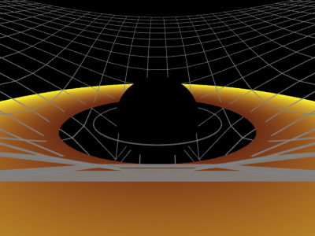

# Instalação do addon Black Hole Bridge 0.8.0

**Guia canônico (instalação + uso + headless):** [`../INSTALAR_E_RODAR.md`](../INSTALAR_E_RODAR.md)

## Resumo

| Blender | Caminho | Arquivo |
|---------|---------|---------|
| 4.0 / 4.1 | Edit → Preferences → Add-ons → **Install…** | `blender/addons/black_hole_bridge.zip` |
| 4.2+ | Preferences → Get Extensions (ou Add-ons) → menu **˅** → **Install from Disk…** | o mesmo zip (traz `blender_manifest.toml`) |
| qualquer 4.x, desenvolvimento | copiar ou criar link simbólico de `blender/addons/black_hole_bridge/` em `<config>/scripts/addons/` | pasta |

Depois: ative **Black Hole Bridge** (categoria *Physics*) → 3D Viewport →
**N** → aba **Black Hole** → **Cena → Build Full Scene**.

Verificado em **Blender 4.0.2** (headless, Cycles). `blender/black_hole_bridge.zip`
é uma cópia byte a byte de `blender/addons/black_hole_bridge.zip`; os dois são
gerados por `make package-addon` (`blender/scripts/package_addon.py`, zip
determinístico com datas fixas). Para conferir se estão em dia:
`python3 blender/scripts/package_addon.py --check`.

## Conferir que funcionou

1. **Build Full Scene** cria a coleção `BH_Scene` com `BH_Core`, `BH_Disk`,
   `BH_Grid`, `BH_Camera`, `BH_Lights` e `BH_Guides`.
2. O relatório mostra `View transform: Raw (OpenGL colour parity)`.
3. Com os parâmetros padrão aparece um **WARNING** de câmera dentro do disco.
   Isso é esperado: a pose padrão do C++ fica dentro do anel. Ponha
   **Parâmetros → Elevação = 1.25** e rode Build de novo.
4. **Numpad 0** + shading **Rendered**: deve aparecer algo como
   [`blender_el125_cycles.png`](../../docs/images/blender_el125_cycles.png).

## Problemas comuns

| Sintoma | Causa / solução |
|---------|-----------------|
| Addon não aparece na lista | Filtre por "Black Hole"; confira se instalou o **.zip** (o Install… não aceita pasta) |
| 4.2+ recusa o zip | Use a instalação por pasta (tabela acima) |
| Disco quase branco | View transform foi trocado para AgX/Filmic; rode Build Full Scene (volta para **Raw**) |
| Disco em pé, vista girada 90° | Cena montada pela 0.7.x; rode **Build Full Scene** na 0.8.0 |
| Grade/anéis somem no render | Cena antiga com arestas soltas; reconstrua (0.8.0 usa Wireframe e curvas com bevel) |
| `bh_render_cpu not found` | `make build` e preencha **Render C++ → Blender → Renderer path** |
| Render Cycles headless dá erro de denoising (Blender do Ubuntu) | Pacote sem OpenImageDenoise: `scene.cycles.use_denoising = False` (e em cada view layer) |

## Atualizar / remover

- **0.7.x → 0.8.0:** Remove → instale o zip novo → reinicie → **Build Full
  Scene** em cada cena (eixos, materiais e modificadores mudaram).
- **Remover:** Preferences → Add-ons → Black Hole Bridge → Remove.
