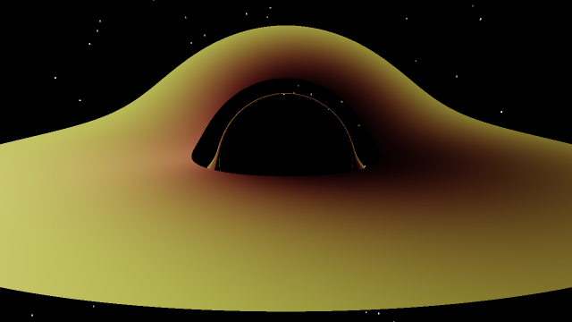
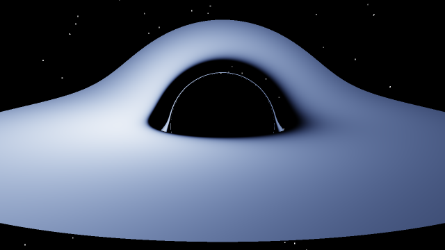
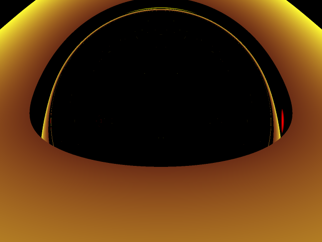
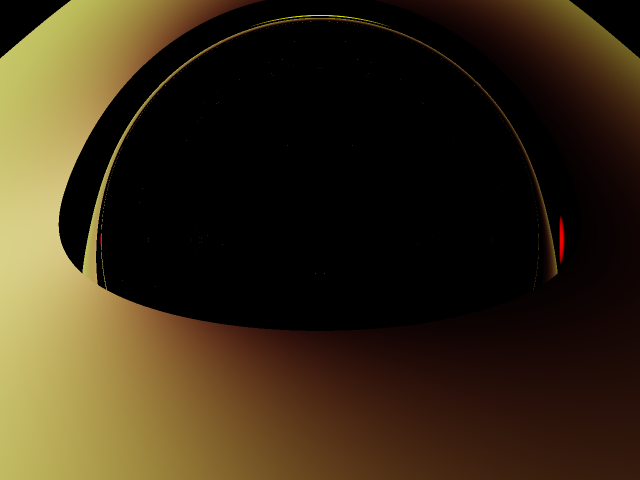
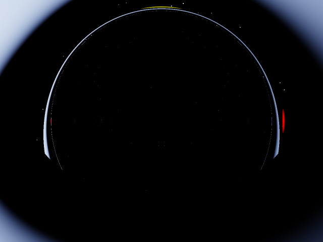

# Disco relativístico — órbitas, redshift, beaming e fluxo de Page–Thorne

Este documento deriva, passo a passo, a física do **disco de acreção relativístico** usada pelos caminhos
**científicos** da versão 0.8.0 e mostra onde cada fórmula está no código. É a referência citada por
`include/black_hole/disk_emission.hpp`.

| Arquivo | Conteúdo |
|---------|----------|
| [`include/black_hole/orbits.hpp`](../include/black_hole/orbits.hpp) | Órbitas circulares tipo-tempo: \(\Omega\), \(u^t\), \(\tilde E\), \(\tilde L\), \(v_{\rm loc}\), \(\eta\) |
| [`include/black_hole/redshift.hpp`](../include/black_hole/redshift.hpp) | Fator \(g=\nu_{\rm obs}/\nu_{\rm emit}\), \(I\propto g^4\), \(T_{\rm obs}=gT\) |
| [`include/black_hole/disk_emission.hpp`](../include/black_hole/disk_emission.hpp) | Fluxo de Page–Thorne em forma fechada, Eddington, corpo negro → sRGB, Reinhard |
| [`src/scientific/cpu_renderer.cpp`](../src/scientific/cpu_renderer.cpp) | Os três modos de cor (`legacy`, `relativistic`, `blackbody`) |
| [`shaders/geodesic_scientific.comp`](../shaders/geodesic_scientific.comp) | Gêmeo GPU (`--scientific` / `--relativistic`), sem modo corpo negro |
| [`tests/test_scientific_ref.cpp`](../tests/test_scientific_ref.cpp), [`tests/test_cpu_render.cpp`](../tests/test_cpu_render.cpp) | Verificações numéricas de tudo abaixo |

> **Contrato de honestidade.** Nada disto altera o caminho default: `BlackHole3D` sem flags continua rodando o
> `geodesic.comp` legado (`legacyEulerStep`, disco 2.2–5.2 rs com cor `vec3(1, r_norm, 0.2)` e alpha `r_norm`).
> Kerr **não** é simulado. Não há transferência radiativa nem GRMHD. Ver [§9](#9-o-que-não-é-modelado).



*`examples/scene_relativistic_showcase.json` (disco 3–12 rs, câmera a 18 rs, elevação 1.40 rad, FOV 38°),
`bh_render_cpu --mode relativistic --stars`, 640×360. O lado distante do disco aparece arqueado sobre a sombra,
há um anel de fótons fino e o lado que se aproxima da câmera (à esquerda) é mais brilhante por Doppler beaming.*

---

## 0. Convenções

- Unidades geométricas \(G=c=1\). No código o parâmetro é `rs` e a massa geométrica é \(M = r_s/2\)
  (`orbits::mass_from_rs`). O renderer CPU e o shader científico trabalham com **rs = 1** (logo \(M = 0.5\)).
- Métrica de Schwarzschild, assinatura \((-,+,+,+)\):
  \[
  \mathrm{d}s^2=-f\,\mathrm{d}t^2+f^{-1}\mathrm{d}r^2+r^2\left(\mathrm{d}\theta^2+\sin^2\theta\,\mathrm{d}\phi^2\right),
  \qquad f(r)=1-\frac{2M}{r}=1-\frac{r_s}{r}.
  \]
- O disco é fino e está no plano perpendicular a um eixo \(\hat n\). No renderer: mundo Y-up, disco no plano XZ,
  \(\hat n=+\hat y\) (`DISK_AXIS = 1`). Para órbitas no disco, \(\phi\) é o azimute em torno de \(\hat n\)
  e \(\theta=\pi/2\).
- Ponto (`.`) como separador decimal, igual ao código.

Tabela de conversão usada no texto:

| Raio | Em \(M\) | Em \(r_s\) |
|------|----------|------------|
| Horizonte | \(2M\) | 1 |
| Esfera de fótons | \(3M\) | 1.5 |
| Parâmetro de impacto crítico \(b_c\) | \(3\sqrt3\,M\approx 5.196\,M\) | \(\approx 2.598\) |
| ISCO | \(6M\) | 3 |
| Pico do fluxo de Page–Thorne | \(\approx 9.55\,M\) | \(\approx 4.78\) |

---

## 1. Órbitas circulares tipo-tempo (`orbits.hpp`)

### 1.1 Velocidade angular \(\Omega\)

Para uma órbita circular equatorial (\(\dot r=\ddot r=0\), \(\theta=\pi/2\)), a componente radial da equação
geodésica dá \(\Gamma^r_{tt}(u^t)^2+\Gamma^r_{\phi\phi}(u^\phi)^2=0\), com \(\Gamma^r_{tt}=fM/r^2\) e
\(\Gamma^r_{\phi\phi}=-rf\). Portanto

\[
\Omega\equiv\frac{u^\phi}{u^t}=\frac{\mathrm{d}\phi}{\mathrm{d}t}=\sqrt{\frac{M}{r^3}}
\qquad(\text{mesma forma de Kepler, mas em tempo coordenado}).
\]

Código: `angular_velocity(r, rs)`.

### 1.2 \(u^t\), energia e momento angular específicos

A normalização \(g_{\mu\nu}u^\mu u^\nu=-1\) dá \((u^t)^2\left(-f+r^2\Omega^2\right)=-1\). Como
\(r^2\Omega^2=M/r\), \(-f+M/r=-(1-3M/r)\):

\[
u^t=\frac{\mathrm{d}t}{\mathrm{d}\tau}=\frac{1}{\sqrt{1-3M/r}} .
\]

As constantes de Killing por unidade de massa são \(\tilde E=-u_t=f\,u^t\) e \(\tilde L=u_\phi=r^2\Omega\,u^t\):

\[
\tilde E=\frac{1-2M/r}{\sqrt{1-3M/r}},\qquad
\tilde L=\frac{\sqrt{Mr}}{\sqrt{1-3M/r}} .
\]

Uma identidade útil para a seção 4: \(\tilde E-\Omega\tilde L=\dfrac{1-2M/r-M/r}{\sqrt{1-3M/r}}=\sqrt{1-3M/r}=1/u^t\).

Código: `u_t`, `specific_energy`, `specific_angular_momentum` (retornam 0 quando \(1-3M/r\le 0\)).

### 1.3 Velocidade local e decomposição de \(u^t\)

Um observador **estático** em \(r\) mede distância própria \(r\,\mathrm{d}\phi\) e tempo próprio
\(\sqrt f\,\mathrm{d}t\), logo

\[
v_{\rm loc}=\frac{r\Omega}{\sqrt f}=\sqrt{\frac{M}{r-2M}},\qquad
\gamma=\frac{1}{\sqrt{1-v_{\rm loc}^2}}=\sqrt{\frac{r-2M}{r-3M}},\qquad
u^t=\frac{\gamma}{\sqrt f}.
\]

A última igualdade mostra que \(1/u^t=\sqrt f/\gamma\) é o produto do redshift gravitacional
(\(\sqrt f\)) pela dilatação temporal do movimento (Doppler transversal, \(1/\gamma\)).
Código: `local_orbital_speed` (retorna 1 quando \(r\le 2M\)).

### 1.4 Existência, estabilidade e a ISCO

- Órbitas circulares tipo-tempo existem só se \(1-3M/r>0\), isto é, \(r>3M=1.5\,r_s\) (`circular_orbit_exists`).
  Na esfera de fótons \(u^t\to\infty\) e \(v_{\rm loc}\to 1\).
- A órbita é estável onde \(\tilde E(r)\) é crescente. Escrevendo \(u=M/r\):

\[
\frac{\mathrm{d}\tilde E}{\mathrm{d}u}
=\frac{-2(1-3u)+\tfrac32(1-2u)}{(1-3u)^{3/2}}
=\frac{3u-\tfrac12}{(1-3u)^{3/2}}=0
\;\Longrightarrow\; u=\tfrac16\;\Longrightarrow\; r_{\rm ISCO}=6M=3\,r_s .
\]

  Do mesmo modo \(\mathrm{d}(\tilde L^2)/\mathrm{d}r=M(1-6M/r)/(1-3M/r)^2\), que se anula no mesmo raio:
  a ISCO é o mínimo comum de \(\tilde E\) e \(\tilde L\). Código: `circular_orbit_is_stable` (\(r\ge 3\,r_s\)).
- Valores na ISCO: \(\tilde E=\sqrt{8/9}\approx0.9428\), \(\tilde L=2\sqrt3\,M\), \(v_{\rm loc}=0.5\,c\), \(u^t=\sqrt2\).

### 1.5 Eficiência radiativa

A matéria que espirala pelo disco até a ISCO e depois cai livremente perde a energia de ligação
\(1-\tilde E_{\rm ISCO}\):

\[
\eta=1-\sqrt{8/9}\approx 0.0572\;(5.72\,\%).
\]

Código: `thin_disk_efficiency()`.

### 1.6 Tabela (saída de `build/gl/quickstart_scientific`, rs = 1)

| \(r/r_s\) | \(v_{\rm loc}/c\) | \(\tilde E\) | \(\tilde L/M\) | Estável? |
|-----------|-------------------|--------------|----------------|----------|
| 1.60 | 0.9129 | 1.50000 | 7.1554 | não |
| 2.20 (borda interna do disco legado) | 0.6455 | 0.96699 | 3.7187 | não |
| 3.00 (ISCO) | 0.5000 | 0.94281 | 3.4641 | sim |
| 4.00 | 0.4082 | 0.94868 | 3.5777 | sim |
| 5.20 (borda externa do disco legado) | 0.3450 | 0.95752 | 3.8231 | sim |
| 10.00 | 0.2357 | 0.97619 | 4.8507 | sim |

**Consequência para o baseline:** o anel legado 2.2–3 rs está **dentro da ISCO**; ali não existe órbita
circular estável. Os modos `legacy`/`relativistic` ainda assim atribuem a ele a cinemática de órbita circular
(instável) — uma aproximação visual. O modo `blackbody` zera a emissão dentro da ISCO (seção 7).

---

## 2. O fator de redshift \(g\) para um raio traçado para trás (`redshift.hpp`)

### 2.1 Convenção do raio traçado

O renderer integra geodésicas nulas **da câmera para a cena**. Seja \(k^\mu=\mathrm{d}x^\mu/\mathrm{d}\lambda\)
o vetor tangente do raio traçado. Ele tem:

- energia conservada \(E=-k_t=f\,k^t>0\);
- vetor momento angular cartesiano \(\vec L=\vec r\times\dfrac{\mathrm{d}\vec r}{\mathrm{d}\lambda}\), com
  \(\vec r=(x,y,z)\) o mergulho cartesiano usual das coordenadas \((r,\theta,\phi)\).

O **fóton físico** percorre o mesmo caminho no sentido oposto, do disco para a câmera:

\[
p^t=k^t,\qquad p^i=-k^i\quad\Longrightarrow\quad p_t=-E,\qquad p_\phi=-k_\phi .
\]

### 2.2 Por que \(L_{\rm axis}=(\vec r\times\mathrm{d}\vec r/\mathrm{d}\lambda)\cdot\hat n\)

Escolha coordenadas esféricas com eixo polar \(\hat n\). Do mergulho
\((x,y,z)=r(\sin\theta\cos\phi,\sin\theta\sin\phi,\cos\theta)\) vem a identidade puramente cinemática

\[
(\vec r\times\dot{\vec r})\cdot\hat n = x\dot y-y\dot x = r^2\sin^2\theta\,\dot\phi .
\]

Em Schwarzschild \(g_{\phi\phi}=r^2\sin^2\theta\) para **qualquer** escolha de eixo polar (simetria esférica),
logo \(r^2\sin^2\theta\,\dot\phi=g_{\phi\phi}k^\phi=k_\phi\): a projeção de \(\vec L\) em \(\hat n\) é exatamente
a componente covariante \(k_\phi\) em torno do eixo do disco. As três componentes de \(\vec L\) são constantes de
Killing (rotações), então \(L_{\rm axis}\) pode ser calculado **uma vez**, na câmera, e usado no ponto de impacto.

No código: `PlanarRay::L_vec = cross(pos, dir)` e `Ly = ray.L_vec[1]` (`cpu_renderer.cpp`); no shader,
`p.Ly = Lvec.y`. Como a direção inicial só tem componentes no próprio plano orbital, o fator \(\sqrt f\) aplicado
à componente radial no referencial do observador estático (seção 2.6) não altera o produto vetorial.

### 2.3 Emissor em órbita circular

A matéria do disco tem quadrivelocidade \(u=u^t(\partial_t+\Omega\,\partial_\phi)\) com \(\phi\) medido em
torno de \(\hat n\) pela regra da mão direita. `spin_sign < 0` inverte o sentido (\(\Omega\to-\Omega\)); só o
**sinal** importa, pois a velocidade kepleriana é fixa.

### 2.4 Derivação

A frequência medida pelo emissor é \(\nu_{\rm emit}\propto-p_\mu u^\mu\):

\[
-p_\mu u^\mu=-u^t\left(p_t+\Omega\,p_\phi\right)=u^t\left(E+\Omega\,k_\phi\right)=u^t E\left(1+\Omega\frac{L_{\rm axis}}{E}\right).
\]

Um receptor estático no infinito mede \(\nu_\infty\propto-p_t=E\). Assim

\[
\boxed{\,g_\infty=\frac{\nu_\infty}{\nu_{\rm emit}}=\frac{1}{u^t\left(1+\Omega\,L_{\rm axis}/E\right)}\,}
\]

Código: `doppler_gravitational_factor(r, rs, E, L_along_axis, spin_sign)`. Casos-limite:

- \(L_{\rm axis}=0\): \(g=1/u^t=\sqrt f/\gamma\) (gravitacional + Doppler transversal). Na ISCO, \(1/\sqrt2\approx0.7071\).
- Emissor estático (\(\Omega=0\)): \(g=\sqrt{1-r_s/r}\) (`gravitational_factor`); \(1+z=1/\sqrt f\)
  (`gravitational_one_plus_z`). Na ISCO, \(\sqrt{2/3}\approx0.8165\).
- \(r\le1.5\,r_s\) (sem órbita circular): o código recua para o fator estático \(\sqrt f\).
- \(E\le0\) ou denominador \(\le0\): retorna 0.

### 2.5 Interpretação: qual lado fica azul

No referencial do observador estático junto ao emissor, a energia local do fóton é \(\varepsilon=E/\sqrt f\) e o
cosseno do ângulo \(\psi\) entre a direção do fóton emitido e a velocidade orbital (ao longo de
\(\hat e_{\hat\phi}=\partial_\phi/r\)) é \(\cos\psi=p^{\hat\phi}/\varepsilon=-k_\phi\sqrt f/(rE)\).
Com \(v_{\rm loc}=r\Omega/\sqrt f\):

\[
\Omega\frac{L_{\rm axis}}{E}=-v_{\rm loc}\cos\psi
\quad\Longrightarrow\quad
g_\infty=\frac{\sqrt f}{\gamma\,(1-v_{\rm loc}\cos\psi)} ,
\]

isto é, redshift gravitacional \(\times\) Doppler relativístico completo.

- **Blueshift** (\(g\) acima de \(1/u^t\)) quando \(\cos\psi>0\): o fóton sai **no sentido do movimento** — o lado
  do disco que **se aproxima** da câmera. Em termos do raio traçado: \(\Omega\,L_{\rm axis}<0\).
- **Redshift** máximo no lado que se afasta (\(\cos\psi<0\)).
- Na ISCO (\(\sqrt f/\gamma=1/\sqrt2\), \(v=0.5\)), receptor no infinito:
  \(g\in\left[\tfrac{\sqrt2}{3},\,\sqrt2\right]\approx[0.471,\,1.414]\).
- Na cena showcase (spin +1) o lado mais brilhante é o da **esquerda** da imagem; `--spin-sign -1` troca o lado
  (verificado em `test_cpu_render.cpp`, `test_relativistic_asymmetry`).

### 2.6 Receptor a raio finito (a câmera)

A câmera é um observador **estático** a \(r_{\rm obs}\) (não está no infinito). Ela mede
\(\nu_{\rm obs}=E/\sqrt{f(r_{\rm obs})}\) — luz que cai num poço gravitacional é desviada para o azul —, logo

\[
g_{\rm obs}=\frac{g_\infty}{\sqrt{1-r_s/r_{\rm obs}}} .
\]

Código: `observer_frequency_factor(r_obs, rs)` e `doppler_gravitational_factor_at(...)`. **É este \(g_{\rm obs}\)
que o renderer CPU e o shader científico usam**, com \(r_{\rm obs}=|\text{posição da câmera}|\).

Coerência com o modelo de câmera: as direções dos pixels vivem no referencial ortonormal do observador estático
(`DirectionFrame::StaticObserver` em `planar_geodesic.hpp`): \(k^r=\sqrt f\,n_r\), \(k^\phi=n_\phi/r\), e para
\(|\vec n|=1\) a energia local do fóton é 1, isto é, \(E=\sqrt{f(r_{\rm obs})}\)
(`test_static_observer_seeding`).

### 2.7 Valores medidos

| Situação | Fonte | \(g\) |
|----------|-------|-------|
| ISCO, emissor estático | `quickstart_scientific` | 0.8165 |
| ISCO, orbitando, \(L_{\rm axis}=0\) | `quickstart_scientific` | 0.7071 (\(=1/u^t\)) |
| ISCO, aproximando-se (\(L=-2.6\), \(E=1\)) | `quickstart_scientific` | 1.0943 → \(I\times1.43\) |
| ISCO, afastando-se (\(L=+2.6\), \(E=1\)) | `quickstart_scientific` | 0.5223 → \(I\times0.07\) |
| Cena default, elevação 1.25, 400×300 (disco 2.2–5.2 rs, câmera 4.997 rs) | `bh_render_cpu` (JSON `min_g`/`max_g`) | 0.392 … 1.621 |
| Cena showcase, 640×360 (disco 3–12 rs, câmera 18 rs) | `bh_render_cpu` | 0.488 … 1.430 |

---

## 3. Doppler beaming: \(I\propto g^4\) e \(T_{\rm obs}=g\,T_{\rm emit}\)

Ao longo de um raio no vácuo, \(I_\nu/\nu^3\) é invariante (teorema de Liouville: conservação do número de
fótons no espaço de fase). Logo

\[
I_{\nu,\rm obs}(\nu_{\rm obs})=g^3\,I_{\nu,\rm emit}(\nu_{\rm obs}/g)
\quad\Longrightarrow\quad
I_{\rm obs}=\int I_{\nu,\rm obs}\,\mathrm{d}\nu_{\rm obs}=g^4\,I_{\rm emit}.
\]

Para um corpo negro, \(B_\nu(T)/\nu^3=\dfrac{2h/c^2}{e^{h\nu/kT}-1}\) depende só de \(\nu/T\); portanto o espectro
observado é **outro corpo negro**, com \(T_{\rm obs}=g\,T_{\rm emit}\).

| Função | Fórmula |
|--------|---------|
| `redshift::intensity_boost(g)` | \(g^4\) (bolométrico) |
| `redshift::observed_temperature(g, T)` | \(g\,T\) |

Exemplo exato na ISCO (receptor no infinito): \(g^4\) vai de \((\sqrt2/3)^4=4/81\approx0.049\) a
\((\sqrt2)^4=4\) — contraste de **81:1** entre os extremos que se aproximam e se afastam. É isso que torna um
lado do disco muito mais brilhante nas imagens relativísticas.

O renderer usa o fator **bolométrico** \(g^4\) para o brilho; não integra o espectro numa banda (onde o
expoente seria outro).

---

## 4. Fluxo de Page–Thorne (`disk_emission.hpp`)

### 4.1 Hipóteses

Disco estacionário, geometricamente fino e opticamente espesso, no plano equatorial; matéria em órbitas
circulares keplerianas (seção 1); **torque nulo na ISCO** (\(r_{\rm in}=6M\)); a energia dissipada localmente é
irradiada localmente (sem advecção, sem radiação que retorna ao disco).

### 4.2 Fórmula geral

Page & Thorne (1974), com \(\sqrt{-g}=r\) no plano equatorial de Schwarzschild:

\[
F(r)=\frac{\dot M}{4\pi r}\;\frac{-\,\Omega_{,r}}{(\tilde E-\Omega\tilde L)^2}
\int_{r_{\rm in}}^{r}(\tilde E-\Omega\tilde L)\,\tilde L_{,r}\,\mathrm{d}r .
\]

### 4.3 Forma fechada

Use \(x=\sqrt{r/M}\) (\(r=Mx^2\), ISCO em \(x_{\rm in}=\sqrt6\)). Pela seção 1:

\[
\tilde E-\Omega\tilde L=\frac{\sqrt{x^2-3}}{x},\qquad
\tilde L=\frac{Mx^2}{\sqrt{x^2-3}},\qquad
\frac{\mathrm{d}\tilde L}{\mathrm{d}x}=\frac{Mx\,(x^2-6)}{(x^2-3)^{3/2}} ,
\]

então o integrando vira uma função racional simples:

\[
(\tilde E-\Omega\tilde L)\,\frac{\mathrm{d}\tilde L}{\mathrm{d}x}=M\,\frac{x^2-6}{x^2-3}=M\left(1-\frac{3}{x^2-3}\right),
\]
\[
\int_{\sqrt6}^{x}M\left(1-\frac{3}{x'^2-3}\right)\mathrm{d}x'
=M\left[x-\sqrt6+\frac{\sqrt3}{2}\ln\frac{(x+\sqrt3)(\sqrt6-\sqrt3)}{(x-\sqrt3)(\sqrt6+\sqrt3)}\right].
\]

O fator externo é \(-\Omega_{,r}/(\tilde E-\Omega\tilde L)^2=\tfrac32M^{1/2}r^{-5/2}/(1-3/x^2)\). Juntando tudo
(e restaurando \(G\)):

\[
\boxed{F(r)=\frac{3GM\dot M}{8\pi r^3}\,R(x)},\qquad
R(x)=\frac{1}{x\left(1-3/x^2\right)}
\left[x-\sqrt6+\frac{\sqrt3}{2}\ln\!\left(\frac{(x+\sqrt3)(\sqrt6-\sqrt3)}{(x-\sqrt3)(\sqrt6+\sqrt3)}\right)\right].
\]

| Código | Papel |
|--------|-------|
| `page_thorne_correction(r_over_M)` | \(R(x)\); retorna 0 para \(r\le6M\) |
| `page_thorne_flux_si(r_m, mass_kg, mdot_kg_s, G, c)` | \(F\) em W/m²; \(M_{\rm geo}=GM/c^2\); \(F=0\) para \(r\le6M_{\rm geo}\) |
| `effective_temperature(F)` | \(T_{\rm eff}=(F/\sigma_{\rm SB})^{1/4}\), \(\sigma_{\rm SB}=5.670374419\times10^{-8}\) W m⁻² K⁻⁴ |

Propriedades: \(R=0\) na ISCO (torque nulo ⇒ fluxo nulo); \(R>0\) fora dela, porque o integrando
\((x^2-6)/(x^2-3)\) é positivo para \(x>\sqrt6\); \(R<1\) e \(R\to1\) longe do buraco; o máximo de
\(F\propto R/r^3\) fica em \(r\approx9.55\,M\approx4.78\,r_s\).

Observação: é o limite \(a_*=0\) da forma fechada de Page–Thorne para Kerr, cujo polinômio \(x^3-3x+2a_*\)
tem raízes \(0,\pm\sqrt3\) quando \(a_*=0\); a raiz \(0\) não contribui e \(\pm\sqrt3\) geram o logaritmo.
Só o caso \(a_*=0\) está implementado.

### 4.4 Limite newtoniano

Fazendo \(\tilde E-\Omega\tilde L\to1\), \(\tilde L=\sqrt{Mr}\), \(\Omega=\sqrt{M/r^3}\):

\[
F_{\rm N}=\frac{\dot M}{4\pi r}\cdot\frac32\sqrt M\,r^{-5/2}\cdot\sqrt M\left(\sqrt r-\sqrt{r_{\rm in}}\right)
=\frac{3GM\dot M}{8\pi r^3}\left(1-\sqrt{\frac{r_{\rm in}}{r}}\right),
\]

o disco de torque nulo clássico (Shakura & Sunyaev 1973); com \(r_{\rm in}=6M\), \(1-\sqrt6/x\).
A forma relativística tem o mesmo comportamento dominante \(F\to3GM\dot M/(8\pi r^3)\) para \(r\gg M\), mas o
coeficiente de \(1/x\) é outro: usando \(\ln\frac{x+\sqrt3}{x-\sqrt3}\approx\frac{2\sqrt3}{x}\),

\[
R(x)=1-\frac{C}{x}+O(x^{-2}),\qquad
C=\sqrt6-\frac{\sqrt3}{2}\ln\frac{\sqrt6-\sqrt3}{\sqrt6+\sqrt3}\approx3.976
\quad(\text{vs. }\sqrt6\approx2.449\text{ newtoniano}).
\]

### 4.5 Como o teste verifica (`test_page_thorne_flux`)

`page_thorne_integral_numeric(r)` em [`tests/test_scientific_ref.cpp`](../tests/test_scientific_ref.cpp) calcula a
integral da seção 4.2 **sem** usar a forma fechada:

- \(M=1\); \(\tilde E,\tilde L,\Omega\) vêm de `orbits.hpp`; \(\tilde L_{,r}\) por diferença central (passo
  \(10^{-6}\)); \(\Omega_{,r}=-\tfrac32 r^{-5/2}\) analítico;
- regra do trapézio com 20 000 intervalos em \([6M,r]\);
- \(R_{\rm num}=F\cdot 8\pi r^3/(3M\dot M)\).

Asserções:

| Verificação | Tolerância |
|-------------|------------|
| \(R(6M)=0\) e \(R(5M)=0\) | exata / \(10^{-15}\) |
| forma fechada vs. quadratura em \(r=7,9,12,30\,M\) | \(2\times10^{-3}\) |
| \(R(10^6 M)\) vs. \(1-C/10^3\) | \(2\times10^{-5}\); e \(R<1\) |
| pico de \(R/r^3\) | entre 8 M e 12 M |
| \(L_{\rm Edd}\) de Sgr A* | entre \(10^{37}\) e \(10^{38}\) W |
| \(T_{\rm eff}(9.6M)\) a 1 % de Eddington | entre \(5\times10^4\) e \(5\times10^5\) K |
| cores de corpo negro | 6500 K ≈ branco; 2000 K com R > G > B; 20 000 K com B > R |
| `tonemap_reinhard(1)` | = 0.5 |

---

## 5. Números de Eddington para Sgr A*

\[
L_{\rm Edd}=\frac{4\pi GMm_pc}{\sigma_T},\qquad
\dot M_{\rm Edd}=\frac{L_{\rm Edd}}{\eta\,c^2},\quad\eta=1-\sqrt{8/9}.
\]

Código: `eddington_luminosity_si`, `eddington_accretion_rate_si` (constantes `PROTON_MASS_KG = 1.67262192e-27`,
`THOMSON_CROSS_SECTION_M2 = 6.6524587e-29`). Valores impressos por `build/gl/quickstart_scientific`:

| Grandeza | Valor |
|----------|-------|
| Massa (mapeamento legado) | \(M=8.54\times10^{36}\) kg |
| \(r_s=2GM/c^2\) | \(1.268388\times10^{10}\) m (literal do shader: `1.269e10`) |
| \(L_{\rm Edd}\) | \(5.40\times10^{37}\) W |
| \(\dot M\) a 1 % de Eddington (default `--mdot-edd 0.01`) | \(1.05\times10^{20}\) kg/s |
| Pico de \(T_{\rm eff}\) (Page–Thorne) | ≈ 86 700 K, em \(r\approx4.78\,r_s\approx9.55\,M\); zero na ISCO |
| Cor do pico (sRGB linear, máx = 1) | (0.38, 0.51, 1.00) — branco-azulado (cor do clamp de 25 000 K, seção 6) |

Como \(F\propto\dot M\), \(T_{\rm eff}\propto\dot M^{1/4}\): `--mdot-edd F` escala o pico por \((F/0.01)^{1/4}\).

> **Honestidade astrofísica.** Um disco fino a 1 % de Eddington é um **cenário didático**. O Sgr A* real acreta
> muitas ordens de grandeza abaixo de Eddington e é descrito por fluxos radiativamente ineficientes (RIAF),
> não por um disco fino de Page–Thorne. O pico de ~87 000 K emite sobretudo no ultravioleta; por isso
> `showcase_blackbody.png` é branco-azulado.



---

## 6. Corpo negro → sRGB e tonemap

`blackbody_rgb(T, r, g, b)`:

1. **Clamp** \(T\in[1667,\,25\,000]\) K (faixa de validade da aproximação).
2. Cromaticidade do lugar planckiano \((x_c,y_c)\) pelos polinômios cúbicos de Kim et al. (2002), com ramos em
   4000 K (para \(x_c\)) e em 2222 K / 4000 K (para \(y_c\)).
3. xyY com \(Y=1\) → XYZ → **sRGB linear** (matriz D65 da IEC 61966-2-1).
4. Componentes negativas → 0; normaliza para que a maior componente seja 1. **Só a cromaticidade** sai daqui;
   o brilho é tratado à parte.

Acima de 25 000 K a cor fica fixa na de 25 000 K. O erro é pequeno: o termo constante do ramo quente,
\(x_c\to0.2404\), é o limite assintótico do lugar planckiano para \(T\to\infty\).

`tonemap_reinhard(c, exposure)` \(=\dfrac{c\,e}{1+c\,e}\) comprime HDR para \([0,1)\). A saída de 8 bits aplica
`--gamma G` (default 1.0 = linear, como a textura legada).

---

## 7. Os modos de render

Notação: \(\rho\) = raio cilíndrico do ponto onde o raio cruza o plano do disco (interpolado no segmento, ver
`hit_testing.hpp`), \(r_n=\rho/r_{\rm out}\), \(g=g_{\rm obs}\) da seção 2.6, \(e\) = exposure (default 2.0).

| Modo | CPU (`bh_render_cpu --mode`) | GPU (`BlackHole3D`) | Cor do disco |
|------|------------------------------|---------------------|--------------|
| Paleta legada | `legacy` | `--scientific` (`colorMode 0`) | \((1,\,r_n,\,0.2)\cdot r_n\) — idêntica ao pixel `vec4(1, r, 0.2, r)` do baseline composto sobre preto |
| Relativístico | `relativistic` | `--relativistic` (`colorMode 1`) | \(k=\mathrm{clamp}(r_n)\,g^4\); RGB \(=\mathrm{Reinhard}_e\big(k,\;\mathrm{clamp}(r_n g,0,1)\,k,\;0.2\,k\big)\) |
| Corpo negro | `blackbody` | — (só CPU) | cor `blackbody_rgb(g\,T_eff(ρ))`, brilho \(4\,g^4\,(T_{\rm eff}/T_{\rm pico})^4\), Reinhard\(_e\) |

Detalhes:

- **Relativístico:** paleta legada multiplicada pelo beaming \(g^4\); o canal verde escala com \(g\) (lado que se
  aproxima → mais branco, lado que se afasta → mais vermelho). É um **mapeamento artístico** de um efeito físico
  correto — não é uma cor espectral.
- **Corpo negro:** \(\dot M=\) `mdot_edd_fraction` \(\times\dot M_{\rm Edd}(\eta)\); \(T_{\rm emit}=T_{\rm eff}(\rho\,r_s)\)
  pela seção 4; \(T_{\rm obs}=g\,T_{\rm emit}\); \(T_{\rm pico}\) é o máximo de \(T_{\rm eff}\) amostrado em 401 pontos
  de 3 a 10 rs (calculado uma vez por imagem);
  \((T_{\rm emit}/T_{\rm pico})^4=F/F_{\rm pico}\), então o brilho é \(\propto g^4F\); o fator 4 mantém o pico
  visível depois do Reinhard. **Dentro da ISCO a emissão é zero**: o disco ali é opaco e preto (no disco legado
  2.2–5.2 rs, o anel 2.2–3 rs aparece escuro).
- Em todos os modos o disco é **opaco**: o raio para no primeiro cruzamento dentro do anel (imagens de ordem
  superior aparecem quando o primeiro cruzamento vem de um raio que já contornou o buraco).
- Câmera exatamente no plano do disco: o primeiro segmento não conta como cruzamento (tolerância relativa
  \(|y|<10^{-6}\,r\), igual na CPU e na GPU).

Exemplos:

```bash
# cena showcase (disco a partir da ISCO), três modos
build/scientific/bh_render_cpu --scene examples/scene_relativistic_showcase.json \
    --mode relativistic --width 640 --height 360 --supersample 2 --stars \
    --out build/renders/showcase_relativistic.png
build/scientific/bh_render_cpu --scene examples/scene_relativistic_showcase.json \
    --mode blackbody --mdot-edd 0.01 --width 640 --height 360 --out build/renders/showcase_blackbody.png
build/scientific/bh_render_cpu --mode relativistic --spin-sign -1 --elevation 1.25 --out rel_flip.png

# GPU (OpenGL 4.3; Mesa llvmpipe serve). Rodar no diretório do binário: os shaders são
# lidos do diretório corrente. O --scene define câmera, FOV e alvo também na GPU.
cd build/gl && ./BlackHole3D --scene ../../examples/scene_relativistic_showcase.json --relativistic
```

`make render` gera os três PNGs de referência em `build/renders/`.

| Paleta legada (CPU, elevação 1.25) | Relativístico (CPU, elevação 1.25) | Corpo negro (CPU, elevação 1.00) |
|---|---|---|
|  |  |  |

---

## 8. Validação

| Teste (CTest) | Função | O que verifica |
|---------------|--------|----------------|
| `scientific_ref` | `test_circular_orbits` | \(v(\text{ISCO})=0.5\), \(v(3M)=1\), \(\tilde E(\text{ISCO})=\sqrt{8/9}\), \(\tilde L(\text{ISCO})=2\sqrt3M\), \(\Omega\), \(\eta\), mínimo de \(\tilde E\) na ISCO, existência só fora de 3M |
| `scientific_ref` | `test_redshift_factors` | \(g=\sqrt f\) estático, \(1+z\), \(L_{\rm axis}=0\Rightarrow g=1/u^t\), sinal de \(L_{\rm axis}\) escolhe azul/vermelho, inversão do spin, \(g^4\), recuo dentro da esfera de fótons |
| `scientific_ref` | `test_static_observer_seeding` | \(E=\sqrt f\) para \(|\vec n|=1\), \(k^r=\sqrt f\,n_r\), \(g_{\rm obs}=g_\infty/\sqrt{f(r_{\rm cam})}\), só o sinal de `spin_sign` importa |
| `scientific_ref` | `test_page_thorne_flux` | Seção 4.5 |
| `scientific_ref` | `test_kerr_analytic` | \(\eta(a_*=0)\) Kerr = \(\eta\) Schwarzschild |
| `cpu_render` | `test_relativistic_asymmetry` | \(\min g\in(0.2,1)\), \(\max g\in(1,2)\), um lado mais brilhante (> 5 %), `spin_sign` troca o lado |
| `cpu_render` | `test_blackbody_mode` | pixels finitos, disco emite |
| `gpu_cpu_agreement` | — | `--relativistic` (GPU, float32) vs `bh_render_cpu --mode relativistic` (CPU, double) nas poses de `tests/test_gpu_cpu_agreement.py` (hoje 5, inclusive FOV 40° com alvo deslocado e meia massa): erro máximo de 1/255 na pose az 0 / el 1.25; nas demais, no máximo 4 pixels de borda em 30 000 fora da tolerância (fração ≤ 1.3e-4, gate 2e-3), erro médio < 0.08/255 (Mesa llvmpipe) |

---

## 9. O que NÃO é modelado

- **Kerr / spin.** `kerr_analytic.hpp` dá só raios analíticos (ISCO, horizontes, ergosfera, órbitas de fótons,
  eficiência). Nenhuma geodésica de Kerr, nenhum frame-dragging, nenhuma sombra dependente do spin.
- **Transferência radiativa:** sem absorção, sem emissão opticamente fina, sem profundidade óptica, sem
  limb darkening, sem espalhamento, sem polarização, sem linhas espectrais (Fe Kα etc.), sem coroa.
- **Estrutura vertical do disco:** plano infinitamente fino. A espessura \(10^9\) m do `DiskUBO` não entra no
  hit test científico. Sem pressão, viscosidade explícita ou estrutura de Novikov–Thorne; só a cinemática
  orbital e o perfil de fluxo de Page–Thorne.
- **Região de mergulho (plunging region):** dentro da ISCO não há emissão em `blackbody`; nos outros modos o anel
  usa cinemática circular instável (aproximação visual).
- **Radiação que retorna ao disco**, autoirradiação, advecção, ventos, jatos.
- **GRMHD**, plasma, campos magnéticos, variabilidade temporal, atrasos de tempo de luz.
- **Espectro integrado:** a cor é a cromaticidade de um único \(T_{\rm obs}\); o brilho usa \(g^4\) bolométrico e é
  **relativo** (normalizado pelo pico + Reinhard + exposure), não um fluxo absoluto calibrado.
- **Câmera em movimento:** a câmera é um observador estático; sem aberração ou Doppler da própria câmera.
- **Fundo celeste:** `--stars` (só CPU) é um campo procedural consultado na direção **assintótica** do raio que
  escapa (portanto lenteado), não um catálogo real nem um HDRI.
- **Disco transparente / múltiplas contribuições:** o raio para no primeiro cruzamento do anel.
- **Modo corpo negro na GPU:** só no `bh_render_cpu`.
- **Sgr A* real:** ver a nota da seção 5.

---

## Referências

- J. M. Bardeen, W. H. Press, S. A. Teukolsky, *Rotating black holes: locally nonrotating frames, energy
  extraction, and scalar synchrotron radiation*, ApJ 178, 347 (1972).
- I. D. Novikov, K. S. Thorne, *Astrophysics of black holes*, em *Black Holes (Les Astres Occlus)*, Gordon & Breach (1973).
- D. N. Page, K. S. Thorne, *Disk-accretion onto a black hole. Time-averaged structure of accretion disk*,
  ApJ 191, 499 (1974).
- N. I. Shakura, R. A. Sunyaev, *Black holes in binary systems. Observational appearance*, A&A 24, 337 (1973).
- C. W. Misner, K. S. Thorne, J. A. Wheeler, *Gravitation*, Freeman (1973), §25.
- G. B. Rybicki, A. P. Lightman, *Radiative Processes in Astrophysics*, Wiley (1979) — invariância de \(I_\nu/\nu^3\).
- *Design of advanced color temperature control system for HDTV applications*, J. Korean Phys. Soc. 41(6),
  865–871 (2002) — aproximação cúbica do lugar planckiano, citada no código como "Kim et al. 2002".
- E. Reinhard, M. Stark, P. Shirley, J. Ferwerda, *Photographic tone reproduction for digital images*,
  ACM SIGGRAPH (2002).

Ver também: [FISICA_SCHWARZSCHILD.md](FISICA_SCHWARZSCHILD.md) (geodésicas, escape, sombra, deflexão),
[MODO_CIENTIFICO.md](MODO_CIENTIFICO.md) (como usar), [GLOSSARIO.md](GLOSSARIO.md).
